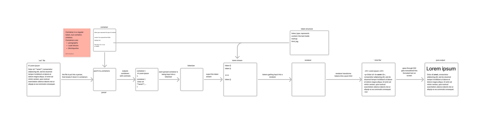

# Rust-md architecture

Rust-md's architecture is heavily inspired by [markdown-it](https://github.com/markdown-it). This document will explain key concepts and.

---

This is a diagram explaining the process behind parsing. Let's follow it through step by step.

## Parser

The parser script takes in the contents of the markdown file and breaks it down into a list of `container` structures.

> ### Container
>
> A container is the high-level tokenized structure of a markdown. Containers are basic blocks of markdown that divide markdown into separate, distinct parts. Each container has inside content that contains more pure markdown that is later parsed into `token`  structures. Eaxamples of containers include:
>
> * Paragraphs (`

`)
> * Breaks (` `)
> * Horizontal Rules (`
`)
> * Headers (`<h1></h1>`)
> * Containers and blocks
> * Blocks of code
> * etc.

After the parser barkes down a markdown file into a stream of `container` structures, this stream goes into a tokenizer that transforms `container`'s contents into children `tokens`.

## Tokenizer

The tokenizer is a script that takes the contents of a `container`, parsers them into `token` structures, and then assigns these `token`s to be children of a `container`. Further, a tokenizer empties the contents of a `container` and assigns a null value to it.

> ### Token
>
> A token is a single independent object within the markdown. Essentially, a token is every structure that receives its own HTML tag. It includes:
>
> * Bold and Italic empathize
> * Code
> * Links and URLs
> * Plain text
> * Images
>
> It should be noted that a `container` is basically a special `token` that stores other tokens.

After a tokenizer creates a stream of tokens, it sends it to a renderer.

## Renderer

The renderer script intakes `token` stream and then turns it into pure HTML that can be downloaded as a file.
